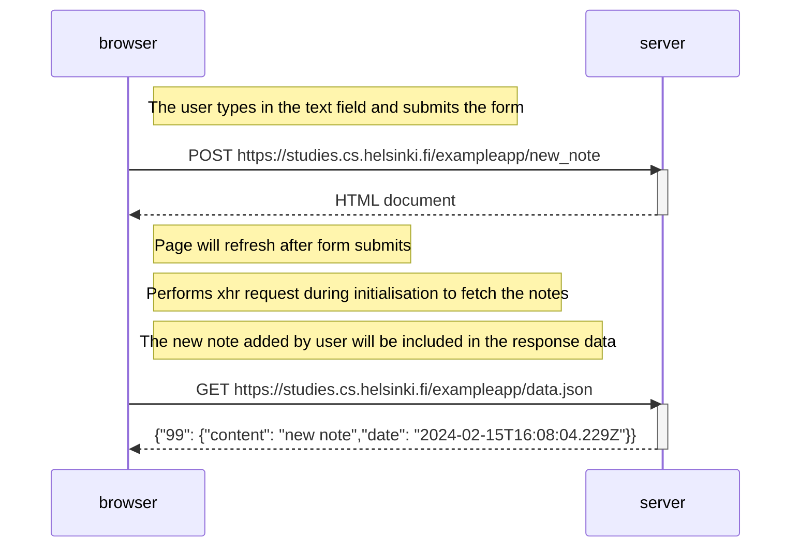

```mermaid
sequenceDiagram
    participant browser
    participant server

    Note right of browser: The user types in the text field and submits the form

    browser->>server: POST https://studies.cs.helsinki.fi/exampleapp/new_note
    activate server
    server-->>browser: HTML document
    deactivate server

    Note right of browser: Page will refresh after form submits
    Note right of browser: Performs xhr request during initialisation to fetch the notes
    Note right of browser: The new note added by user will be included in the response data

    browser->>server: GET https://studies.cs.helsinki.fi/exampleapp/data.json
    activate server


    server-->>browser: {"99": {"content": "new note","date": "2024-02-15T16:08:04.229Z"}}
    deactivate server
```
